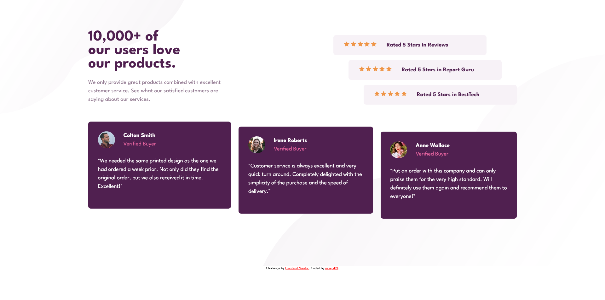

# Frontend Mentor - Social proof section solution

This is a solution to the [Social proof section challenge on Frontend Mentor](https://www.frontendmentor.io/challenges/social-proof-section-6e0qTv_bA). Frontend Mentor challenges help you improve your coding skills by building realistic projects. 

## Table of contents

- [Overview](#overview)
  - [The challenge](#the-challenge)
  - [Screenshot](#screenshot)
  - [Links](#links)
- [My process](#my-process)
  - [Built with](#built-with)
  - [What I learned](#what-i-learned)
  - [Useful resources](#useful-resources)
- [Author](#author)

## Overview

### The challenge

Users should be able to:

- View the optimal layout for the section depending on their device's screen size

### Screenshot

### Links

- Solution URL: [Add solution URL here](https://your-solution-url.com)
- Live Site URL: [Add live site URL here](https://your-live-site-url.com)

## My process

### Built with

- Semantic HTML5 markup
- CSS custom properties
- Flexbox
- Mobile-first workflow
- SCSS

### What I learned

1. SCSS basics
2. 7-1 SCSS folder structure 
3. vanilla css variables vs SCSS variables 
- Vanilla css variables can have their value changed depending on different
  circumstances i.e. media queries. SCSS variables can't, as upon compiling
  they are replaced with their values.

### Useful resources
- https://www.youtube.com/watch?v=_a5j7KoflTs - taught me the very basics of SCSS, careful with the html in that video, the heading structure is not correct, using incorrect html practices like that can lead to accessibility and SEO problems.

## Author

- Github - https://github.com/maxp421
- Frontend Mentor -https://www.frontendmentor.io/profile/maxp421